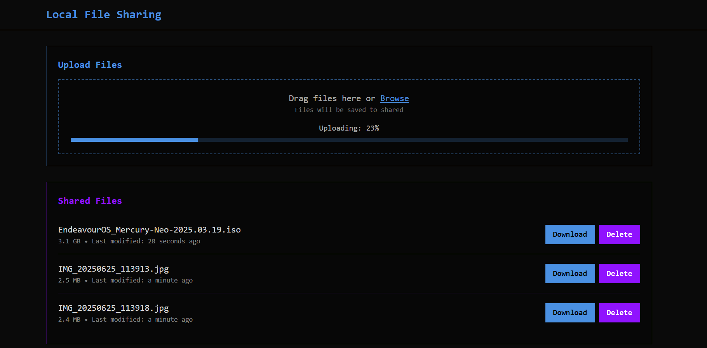

# FileFlow - Local Network File Sharing



FileFlow is a lightning-fast file sharing solution for local networks. Built with modern web technologies, it enables seamless file transfers between devices without the need for external services or complicated setup.

## Why FileFlow?

- 🚀 **Instant Setup** - Running in seconds, no configuration needed
- 🔒 **Local Network Only** - Your files never leave your network
- 💫 **Modern Interface** - Clean, responsive design that just works
- 🎯 **Simple Yet Powerful** - Drag & drop, progress tracking, and more

## Quick Start

```bash
git clone https://github.com/yourusername/fileflow.git
cd fileflow
pip install -r requirements.txt
python app.py
```

Then open `http://localhost:5000` in your browser. That's it!

## Features in Detail

### Smart File Management
- Drag & drop multiple files
- Real-time upload progress
- Automatic file cleanup on server shutdown
- File type filtering and size limits

### Network Accessibility
- Access from any device on your network
- No internet connection required
- Configurable port and host settings
- Auto-discovery of server IP (coming soon)

### Security First
- Local network isolation
- File sanitization
- Configurable access controls
- Session management

## Tech Stack

- Backend: Python + Flask
- Frontend: Vanilla JS + Tailwind CSS
- File Processing: Werkzeug
- Development: Poetry for dependency management

## Development Setup

1. Install Python 3.8 or newer
2. Clone the repository
3. Set up your environment:

```bash
python -m venv venv
source venv/bin/activate  # Windows: venv\Scripts\activate
pip install -r requirements.txt
```

4. Start the development server:

```bash
python app.py
```

## Configuration

Create a `.env` file in the project root:

```env
PORT=5000
HOST=0.0.0.0
MAX_FILE_SIZE=500MB
ALLOWED_EXTENSIONS=pdf,jpg,png,zip
```

## Contributing

We welcome contributions! Please check our [Contributing Guide](CONTRIBUTING.md) for details on:

- Code style and standards
- Development workflow
- Pull request process
- Bug reporting

## License

Released under MIT License. See [LICENSE](LICENSE) for details.

---

<div align="center">
Made with ❤️ by [Your Name]
</div>
