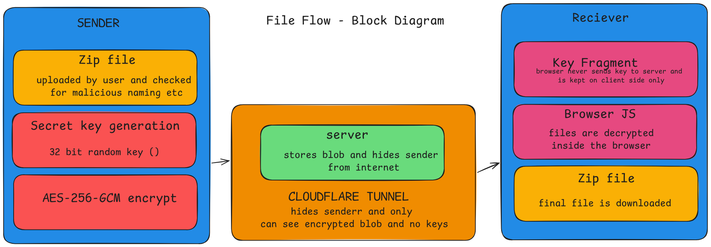

# FileFlow

A zero-knowledge file sharing tool. Encrypts files client-side, tunnels them through Cloudflare, and decrypts them in the recipient's browser — the server never sees the key or the plaintext.


## How it works



| Step | What happens |
|---|---|
| 1. Upload | Open the local web UI and select a file to share |
| 2. Encrypt | File is encrypted with AES-256-GCM using a one-time generated key |
| 3. Tunnel | A Cloudflare Tunnel spins up, exposing the server via a `trycloudflare.com` URL (printed in the terminal) and masking your real IP |
| 4. Key embed | The key is base64-encoded into the URL fragment (`#key=...`) — never sent to or stored on the server |
| 5. Share | Send the generated `trycloudflare.com` link to the recipient |
| 6. Decrypt | Recipient's browser extracts the key from the fragment and decrypts the file client-side before download |


## Usage

```bash
# clone the repo
git clone https://github.com/CheefLofter/FileFlow.git
cd FileFlow
# make venv and install requirements
python3 -m venv .venv

#linux/mac 
source .venv/bin/activate

#windows
.venv/Scripts/activate

pip install -r requirements.txt
python main.py
```

The tunnel URL will be printed in the terminal — open it in your browser, upload a file, and share the link it generates.


## Stack

- Python 3.13 / Flask
- AES-256-GCM (PyCryptodome)
- Cloudflare Tunnel (flask-cloudflared)
- Vanilla JS for client-side decryption


## Project structure

```
FileFlow/
├── Assets/        # logo, diagrams
├── src/           # encryption logic
├── templates/     # sender/receiver UI
├── test-files/    # sample files
├── tests/         # unit tests
└── main.py
```

## Why

Built to get hands-on with zero-knowledge architecture, AES-GCM, and key handling without ever exposing the key to the server or any intermediary.

